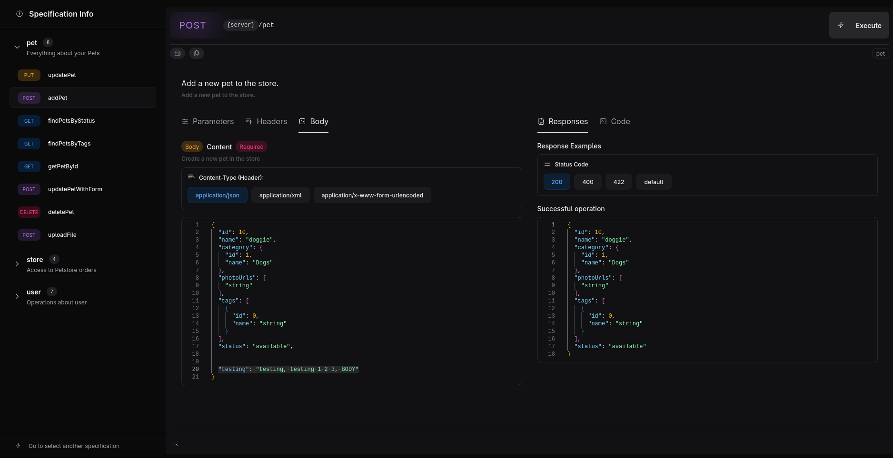
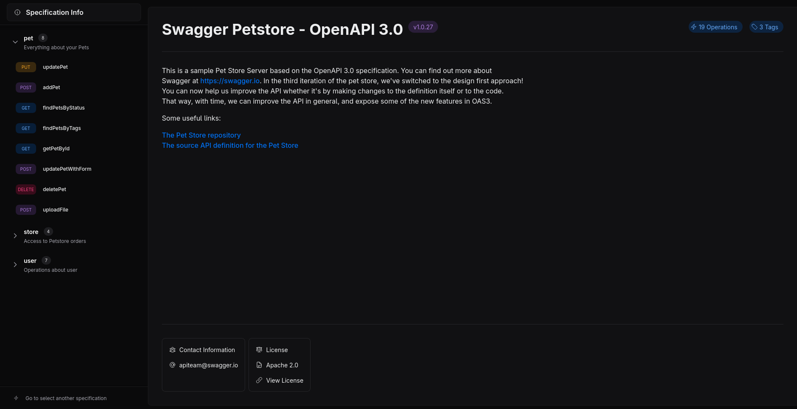
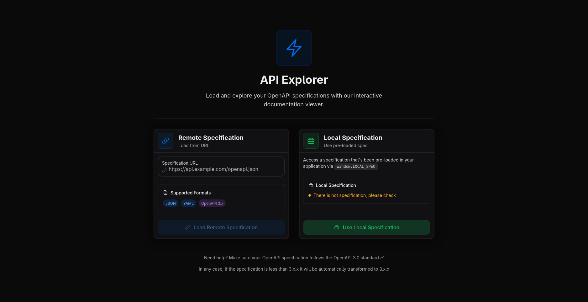

# Swagman Web

A modern, lightweight OpenAPI/Swagger explorer built with React, TypeScript, and Vite. Swagman Web provides an intuitive interface for exploring, testing, and generating code for REST APIs.



## ✨ Features

## Specification Info

You can see the specification details into the `Specification Info` panel



---

## Using an operation

Here is where you can make your requests based in the operations defined into the openapi file


---

## Change specification at any time

You can select any specification but we recommend to use only 3.x.x `openapi` version



## 🛠️ Tech Stack

- **Frontend**: React 18, TypeScript, Vite
- **UI Library**: HeroUI (NextUI successor)
- **Styling**: Tailwind CSS, Framer Motion
- **State Management**: Zustand
- **Editor**: Monaco Editor
- **HTTP Client**: SwaggerClient
- **Build Tool**: Vite

## 🚀 Quick Start

## 🔧 Usage

### Loading an API Specification

- **From query param**: You can add to the url `?url=your-specification.json` and swagman automatically will show you the rest client
- **From manual panel**: Go to `http://localhost:5173/#/specification-selector` and set your specification
- **From local**: You can also set a local specification, It should appear in `http://localhost:5173/#/` once you set in javascript the `window.LOCAL_SPEC` object

### Testing API Endpoints

1. **Select Operation**: Choose an endpoint from the API explorer
2. **Configure Parameters**: Fill in required parameters, headers, and request body
3. **Select Server**: Choose the target server environment
4. **Send Request**: Execute the request and view the response

### Prerequisites

- Node.js 18+
- npm or yarn

### Installation

```bash
# Clone the repository
git clone https://github.com/yourusername/swagman-web.git

# Navigate to project directory
cd swagman-web

# Install dependencies
npm install

# Start development server
npm run dev
```

The application will be available at `http://localhost:5173`

### Available Scripts

```bash
# Development
npm run dev          # Start development server

# Build
npm run build        # Build for production
npm run build:embed  # Build embed version
npm run preview      # Preview production build

# Code Quality
npm run lint         # Run ESLint
```

## 📁 Project Structure

```
src/
├── app/                    # Application setup and providers
├── features/              # Feature-based modules
│   ├── api-explorer/     # API exploration components
│   ├── operation/        # API operation components
│   ├── request-body/     # Request body builder
│   └── specification/    # Spec loading components
├── hooks/                # Custom React hooks
├── layouts/              # Layout components
├── lib/                  # External library configurations
├── models/               # TypeScript models/interfaces
├── pages/                # Page components
└── shared/               # Shared utilities and components
    ├── components/       # Reusable UI components
    ├── constants/        # Application constants
    ├── styles/           # Global styles
    ├── types/            # TypeScript type definitions
    └── utils/            # Utility functions
```

## 📦 Embed Mode

Swagman Web can be embedded into existing applications as a lightweight, self-contained component. This is perfect for API documentation sites, developer portals, or any application that needs to display interactive API documentation.

### Building for Embed

```bash
# Build the embed version
npm run build:embed
```

This creates a single JavaScript file (`dist-embed/swagman-embed.js`) that can be included in any HTML page.

### Browser Support

The embed mode supports all modern browsers:

- Chrome 88+
- Firefox 85+
- Safari 14+
- Edge 88+

### Performance

The embed build is optimized for size and performance:

- No external dependencies required
- Lazy loading for optimal performance
- Tree-shaken build for minimal footprint

## 🚀 Deployment

Build the project and serve the `dist` folder:

```bash
npm run build
# Serve the dist folder with your preferred static file server
```

For embed deployments:

```bash
npm run build:embed
# Copy dist-embed/swagman-embed.js to your server
```

## 🤝 Contributing

Contributions are welcome! Please feel free to submit a Pull Request.

### Development Guidelines

1. Follow the existing code style and patterns
2. Write TypeScript types for all new code
3. Update documentation as needed
4. Run to check types: `npm run build`
5. Run linting before submitting: `npm run lint`

### Feature Requests

Have an idea for a new feature? Please open an issue to discuss it first.

## 📝 License

This project is licensed under the MIT License - see the [LICENSE](LICENSE) file for details.

## 🙏 Acknowledgments

- [HeroUI](https://github.com/heroui-inc/heroui) for the amazing component library
- [Monaco Editor](https://microsoft.github.io/monaco-editor/) for the code editor
- [OpenAPI Initiative](https://www.openapis.org/) for the OpenAPI specification
- [Swagger](https://swagger.io/) for API development tools

---

**I hope you find this tool useful :)**
**Both constructive and destructive feedback will be appreciated.**
